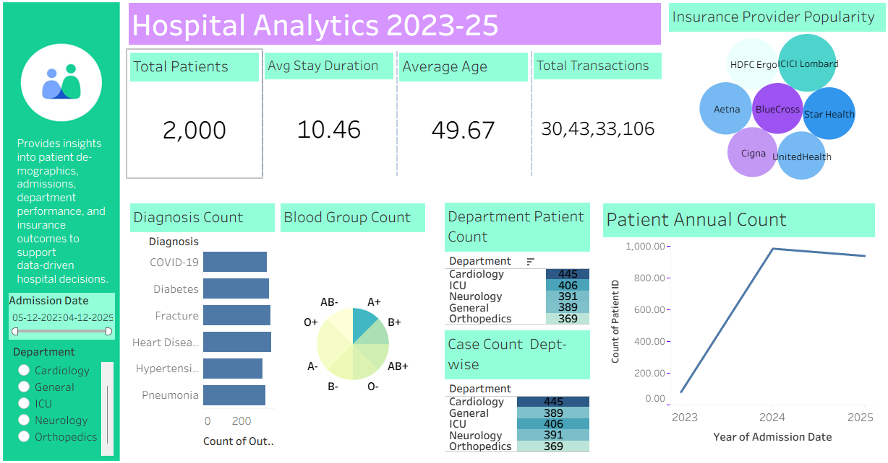
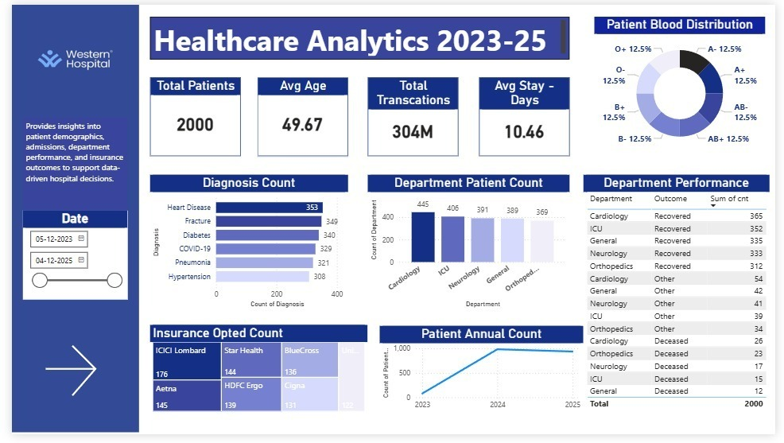

# Healthcare Analytics Dashboard (Tableau & Power BI)

## Project Objective
The objective of this project is to analyze hospital operational performance and patient trends using interactive business intelligence dashboards. The project transforms structured healthcare data into actionable insights that support hospital management in monitoring patient activity, departmental workload, and operational efficiency.

## Dataset Used
- Structured healthcare dataset containing **10,000+ patient records** stored in CSV format.
- The dataset includes information related to **patient admissions, diagnosis, departments, insurance providers, blood groups, patient age, and transaction values**.
- Data spans the period **2023–2025**, enabling trend analysis across multiple years.

## Business Questions (KPIs)
- What is the total number of patient admissions over time?
- Which hospital departments handle the highest patient volume?
- What are the most common patient diagnoses?
- What is the distribution of patient blood groups?
- Which insurance providers are most frequently used?
- How have patient admissions grown from **2023 to 2025**?
- What is the average patient age and average hospital stay duration?

## Process
- Cleaned and standardized healthcare data to ensure consistency across admission records.
- Structured diagnosis categories, department labels, blood group fields, and insurance provider information.
- Performed **Exploratory Data Analysis (EDA)** to understand patient distribution patterns.
- Created calculated metrics and KPIs for hospital performance evaluation.
- Designed interactive dashboards using **Tableau and Power BI** to visualize key insights.
- Implemented filters and slicers to allow dynamic exploration of hospital data.

## Dashboard Features
The dashboards provide a consolidated view of key hospital performance indicators including:

- **Total Patient Admissions**
- **Average Patient Age**
- **Average Length of Stay**
- **Total Transaction Value**
- **Department-wise Patient Distribution**
- **Diagnosis Category Analysis**
- **Insurance Provider Utilization**
- **Blood Group Distribution**
- **Year-wise Patient Admission Trends (2023–2025)**

## Dashboard Visualization

### Tableau Dashboard

### Power BI Dashboard

## Key Insights
- Departments such as **Cardiology, ICU, and Orthopedics** show higher patient volumes.
- Certain diagnoses such as **Hypertension, Diabetes, and Fractures** represent a large proportion of admissions.
- Insurance provider usage varies significantly across departments.
- Patient admission trends indicate **steady growth in hospital utilization between 2023 and 2025**.
- Blood group distribution analysis helps understand patient demographic composition.

## Tools & Technologies Used
- **Tableau**
- **Power BI**
- **Microsoft Excel**
- **CSV Data Processing**
- **Exploratory Data Analysis (EDA)**
- **KPI Reporting**
- **Data Visualization**

## Final Conclusion
This project demonstrates how healthcare data can be transformed into interactive business intelligence dashboards to support operational monitoring and performance evaluation. By visualizing patient trends, departmental workload, and key hospital KPIs, the dashboards enable healthcare administrators to make informed decisions and improve hospital service efficiency.
